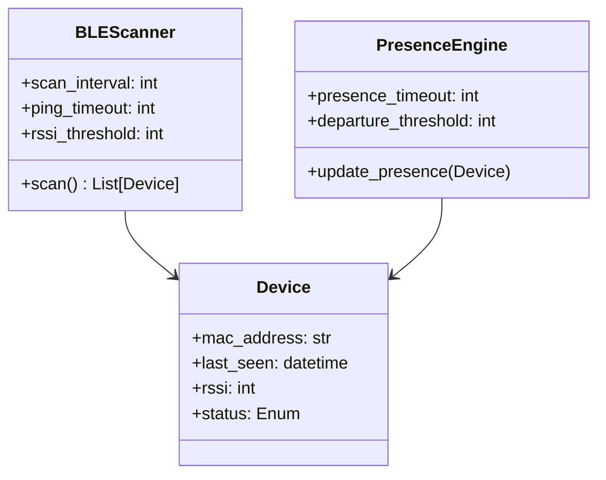
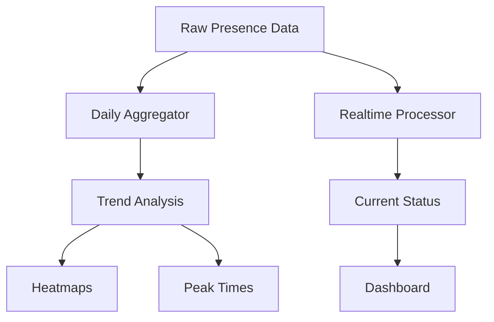

# FabLab Presence Tracking System - Technical Specifications

## 1. Core Tracking System


## 2. Data Schema
```sql
CREATE TABLE devices (
    device_id TEXT PRIMARY KEY,
    anonymous_id TEXT,
    first_seen DATETIME,
    last_seen DATETIME,
    status TEXT CHECK(status IN ('present', 'absent', 'departed'))
);

CREATE TABLE presence_logs (
    log_id INTEGER PRIMARY KEY,
    device_id TEXT,
    timestamp DATETIME,
    status TEXT,
    rssi INTEGER,
    FOREIGN KEY(device_id) REFERENCES devices(device_id)
);

CREATE TABLE occupancy_aggregates (
    date DATE,
    hour INTEGER,
    present_count INTEGER,
    PRIMARY KEY(date, hour)
);
```

## 3. Configuration Parameters
| Parameter | Default | Description |
|-----------|---------|-------------|
| scan_interval | 30 | Seconds between scans |
| ping_timeout | 3 | Missed pings before 'absent' |
| departure_threshold | 5 | 'Absent' pings before 'departed' |
| rssi_threshold | -80 | Minimum signal strength |
| data_retention_days | 90 | Days to keep raw logs |

## 4. Analytics Engine


## 5. Privacy Implementation
- MAC address anonymization (SHA-256 hashing)
- Configurable data retention
- Opt-in/out registration portal
- Automatic purging of stale devices

## 6. API Endpoints
- `GET /api/presence/current` - Current occupancy
- `GET /api/presence/history` - Historical data
- `POST /api/devices/register` - Opt-in registration
- `GET /api/analytics/trends` - Usage trends

Would you like me to:
1. Add implementation timelines
2. Include sample dashboard designs
3. Provide more detailed database schemas
4. Proceed with development planning?