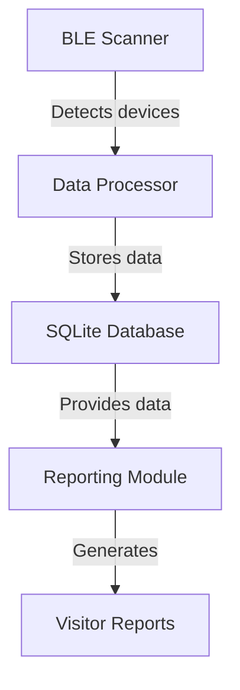

# FabLab Visitor Logger System Design

## Overview
A Raspberry Pi-based system to log visitors via Bluetooth Low Energy (BLE) device detection, storing MAC addresses, timestamps, and signal strength in an SQLite database.

## System Architecture


## Technology Stack
- **BLE Scanning**: Python with `bluepy` or `bleak` library
- **Database**: SQLite3 (built into Python)
- **CLI Interface**: Python + `argparse`
- **Scheduling**: Systemd service

## Data Schema
```sql
CREATE TABLE visitor_logs (
    id INTEGER PRIMARY KEY AUTOINCREMENT,
    mac_address TEXT NOT NULL,
    timestamp DATETIME DEFAULT CURRENT_TIMESTAMP,
    rssi INTEGER,
    UNIQUE(mac_address, timestamp)
);
```

## Implementation Phases

1. **Core Scanning Module**
   - BLE device discovery every 30 seconds
   - MAC address and RSSI collection
   - Timestamp recording

2. **Data Storage Layer**
   - SQLite database setup
   - Data insertion with duplicate prevention
   - Database maintenance functions

3. **Reporting Interface**
   - CLI commands:
     - `list-devices`: Show all detected devices
     - `stats`: Show visit statistics
     - `export-csv`: Export data to CSV

4. **Deployment Setup**
   - Systemd service configuration
   - Installation script
   - Documentation

## Next Steps
1. Implement core scanning functionality
2. Set up database and storage layer
3. Develop reporting interface
4. Configure deployment